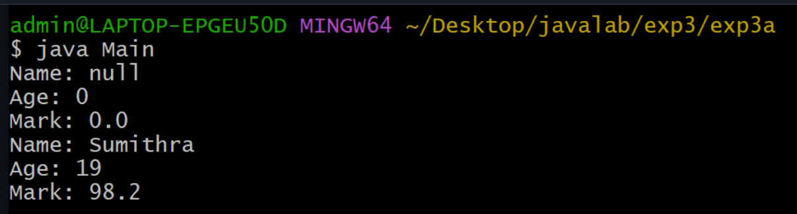
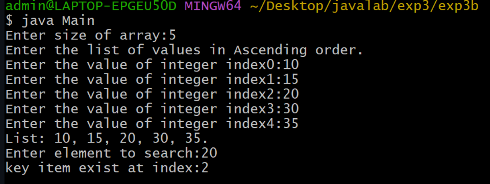
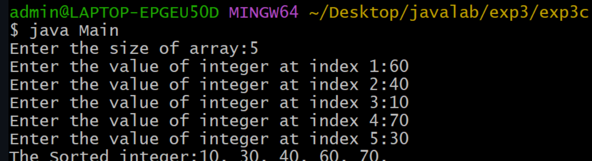

## EXPERIMENT-3
## EXP-3a)Title:Implement constructor overlapping in JAVA.
## Source code:
``` java
class Student{
  String name;
  int age;
  double marks;
  Student(){
  }
  Student(String name,int age,double marks){
    this.name = name;
    this.age = age;
    this.marks = marks;
  }
  void display(){
    System.out.println("Name: " + name);
    System.out.println("Age: " + age);
    System.out.println("Mark: " + marks);
  }
}
class Main{
  public static void main(String args[]){
    Student std = new Student();
    std.display();
    Student std1 = new Student("Sumithra",19,98.2);
    std1.display();
  }
} 
```
## OUTPUT:


# 3b) Write a JAVA program to search for an element in a given list of elements using binary search mechanism.
# Source Code:
``` java
import java.util.Scanner;
class BinarySearch{
  int list[];
  int size;
  BinarySearch(int size){
    list = new int[size];
    this.size = size;
  }
  void setlist(){
    Scanner sc = new Scanner(System.in);
    System.out.println("Enter the list of values in Ascending order.");
    for(int i=0;i<size;i++){
      System.out.print("Enter the value of integer index" + i + ":" );
      list[i]= sc.nextInt();
    }
  }
  void getlist(){
    System.out.print("List: ");
    for(int i=0;i<size;i++){
      System.out.print(list[i]+", ");
    }
    System.out.println("\b\b.");
  }
  int binarysearch(int key){
    int low=0;int high=size-1;
    while(low <= high){
      int mid = (low+high)/2;
      if(list[mid] == key){
       return mid;
      }
      else if (list[mid] < key){
        low = mid+1;
      }
      else 
        high = mid-1;
      }
      return -1;
    }
  }
import java.util.Scanner;
class Main{
  public static void main(String args[]){
    Scanner sc = new Scanner(System.in);
    System.out.print("Enter size of array:");
    int size = sc.nextInt();
    BinarySearch bs = new BinarySearch(size);
    bs.setlist();
    bs.getlist();
    System.out.print("Enter element to search:");
    int key =sc.nextInt();
    int index = bs.binarysearch(key);
    if(index == -1)
      System.out.println("key item does not exist");
    else
      System.out.println("key item exist at index:" + index);
    sc.close();
  }
}
```
## Output:


## 3c)Title:Develop a JAVA program to sort for for an element in a given list of elements using bubble sort.
# Souce Code:
``` java
class BubbleSort {
  void bubblesort(int arr[]){
    int n = arr.length;
    int temp = 0;
    for(int i=0;i<n-1;i++){
      for(int j=0;j<n-i-1;j++){
        if(arr[j] > arr[j+1]){
          temp = arr[j+1];
          arr[j+1] = arr[j];
          arr[j] = temp;
        }
      }
    }
  }
}

import java.util.Scanner;
class Main {
  public static void main(String args[]){
    System.out.print("Enter the size of array:");
    Scanner sc = new Scanner(System.in);
    int size = sc.nextInt();
    int integer[] = new int[size];
    for(int i=0;i<size;i++){
      System.out.print("Enter the value of integer at index "+(i+1)+":");
      integer[i] = sc.nextInt();
    }
    BubbleSort bs = new BubbleSort();
    bs.bubblesort(integer);
    System.out.print("The Sorted integer:");
    for(int i=0;i<size;i++)
     System.out.print(integer[i]+", ");
     System.out.println("\b\b.");
  }
}
```
# Output:



  
 
