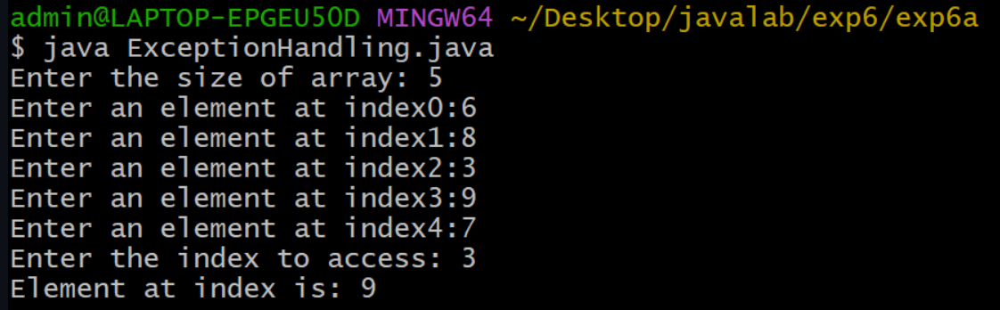
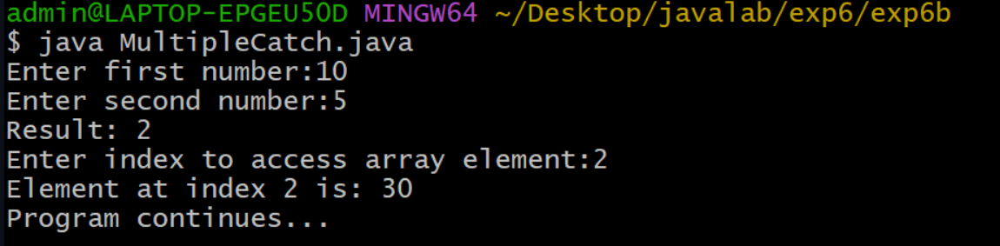
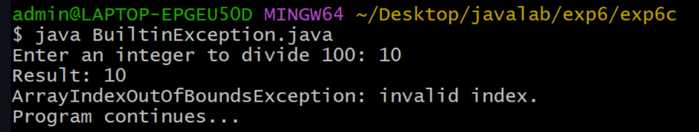

# EXPERIMENT-6
# TITLE:6A) Write a JAVA program that describes exception handling mechanism.
# SouceCode :
``` java

import java.util.Scanner;
class ExpectionHandling {
  public static void main(String args[]) {

      Scanner sc = new Scanner(System.in);
      System.out.print("Enter the size of array: ");
      int n = sc.nextInt();
      int[] arr = new int[n];
      for ( int i=0;i<n;i++) {
          System.out.print("Enter an element at index"+i+":");
          arr[i] =  sc.nextInt();
      }
       int index;
          System.out.print("Enter the index to access: ");
           index = sc.nextInt();

          try {
              System.out.println("Element at index is: " +arr[index]);
          }
          catch (ArrayIndexOutOfBoundsException e) {
              System.out.println("Invalid index ! please enter index between 0 and n-1 ");
          
          System.out.println("Exception is : "+e);
          }
     sc.close();
  }
}
```
# OUTPUT:


# 6b) Write a JAVA program Illustrating Multiple catach clauses.
# Sourcecode:
``` java
import java.util.Scanner;
import java.util.InputMismatchException;

class MultipleCatch {
    public static void main(String[] args) {

        Scanner sc = new Scanner(System.in);
        int[] arr = {10, 20, 30};

        try {
            System.out.print("Enter first number:");
            int a = sc.nextInt();

            System.out.print("Enter second number:");
            int b = sc.nextInt();

            int result = a / b;
            System.out.println("Result: " + result);

            System.out.print("Enter index to access array element:");
            int index = sc.nextInt();

            System.out.println("Element at index " + index + " is: " + arr[index]);
        }
        catch (ArithmeticException e) {
            System.out.println("Error: Division by zero is not allowed.");
        }
        catch (InputMismatchException e) {
            System.out.println("Error: Please enter numeric values only.");
        }
        catch (ArrayIndexOutOfBoundsException e) {
            System.out.println("Error: Invalid array index.");
        }

        System.out.println("Program continues...");
        sc.close();
    }
}
```
# OUTPUT:


# 6c) Write a JAVA program for creation of Java Built-in Exceptions.
# SourceCode:
``` java
import java.util.Scanner;

 class MultipleExceptions {
    public static void main(String[] args) {

        Scanner sc = new Scanner(System.in);

        try {
            System.out.print("Enter an integer to divide 100: ");
            int n = sc.nextInt();
            int result = 100 / n;
            System.out.println("Result: " + result);
            int[] arr = new int[3];
            System.out.println("Accessing element: " + arr[5]);
            System.out.print("Enter a number as text: ");
            sc.nextLine();
            String s = sc.nextLine();
            int num = Integer.parseInt(s);
            System.out.println("Converted number: " + num);
        }
        catch (ArithmeticException e) {
            System.out.println("ArithmeticException: division by zero.");
        }
        catch (ArrayIndexOutOfBoundsException e) {
            System.out.println("ArrayIndexOutOfBoundsException: invalid index.");
        }
        catch (NumberFormatException e) {
            System.out.println("NumberFormatException: invalid numeric format.");
        }
        catch (Exception e) {
            System.out.println("Some other exception occurred.");
        }

        System.out.println("Program continues...");
        sc.close();
    }
}
```
# OUTPUT:

